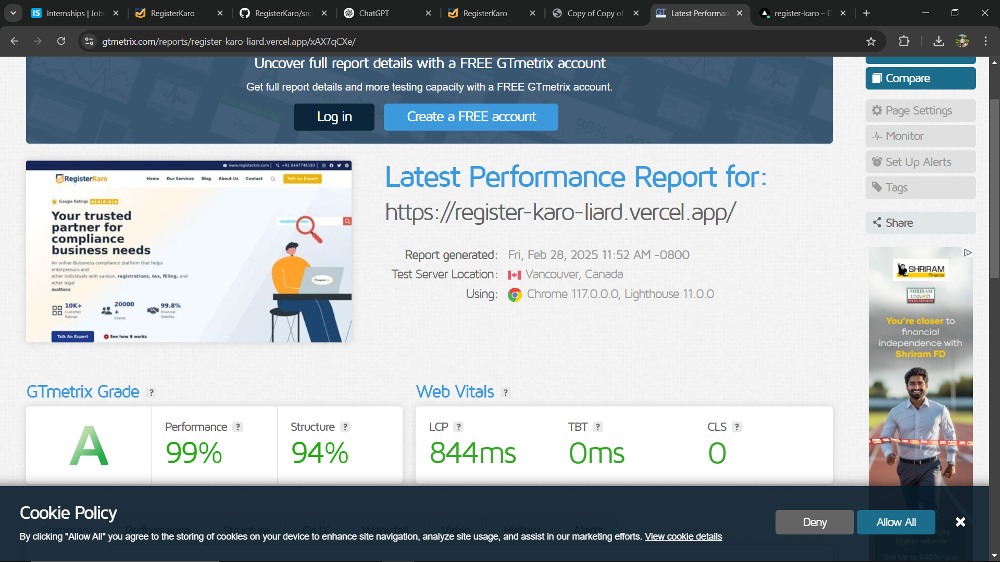

### 📄 **README for RegisterKaro**  

---

# 🏢 **RegisterKaro**  
A modern compliance solution website built using **React (Vite) & Tailwind CSS**.  

---

## 🚀 **Live Demo**  
🔗 [https://register-karo-liard.vercel.app/](#) 

---

## 📸 **Screenshots**  

### **Homepage**  
  

### **Page Insight**  
  

---

## 🛠 **Tech Stack**  
- **Frontend**: React (Vite) ⚡  
- **Styling**: Tailwind CSS 🎨  
- **Icons**: React Icons 🔥  
- **Deployment**: Vercel  🌎  

---

## 📂 **Project Setup**  

### 🔧 **1. Clone the Repository**  
```sh
git clone https://github.com/anil29717/RegisterKaro.git
cd RegisterKaro
```

### 📦 **2. Install Dependencies**  
```sh
npm install
```

### 🏗 **3. Start Development Server**  
```sh
npm run dev
```
> The website will be available at **`http://localhost:5173`**  

---

## 🏗 **Build for Production**  
```sh
npm run build
```
> This will create an optimized `dist` folder for deployment.

---

## 🚀 **Deployment on Vercel**  
1. Install Vercel CLI  
   ```sh
   npm install -g vercel
   ```
2. Deploy  
   ```sh
   vercel
   ```

---

## 💡 **Features**  
✅ **Modern UI** – Clean & minimal design using Tailwind CSS  
✅ **Fast Performance** – Optimized with Vite  
✅ **Responsive Design** – Works on all devices  
✅ **FAQ Section** – Interactive FAQ dropdown  
✅ **Tech Partners Section** – Displays brand logos  

---

## 🛠 **Folder Structure**  
```
RegisterKaro
│── public/             # Static assets
│── src/                # Source code
│   │── components/     # Reusable components
│   │── pages/          # Page components
│   │── assets/         # Images & icons
│   └── App.jsx         # Main App file
│── .gitignore          # Ignore node_modules
│── package.json        # Project dependencies
│── README.md           # Documentation
└── vite.config.js      # Vite configuration
```

---

## 📬 **Contact**  
👤 **Anil Kumar**  

---

Give this repo a ⭐ if you like it! 🚀